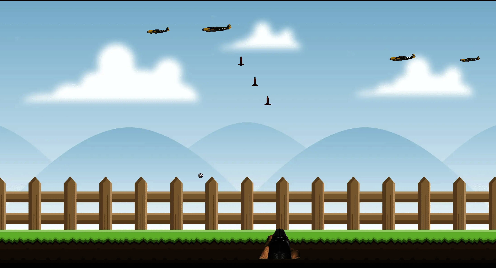
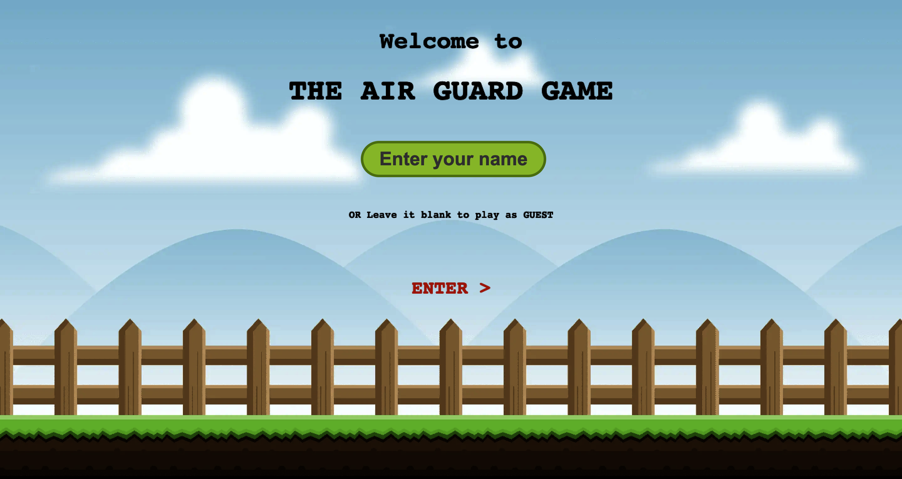
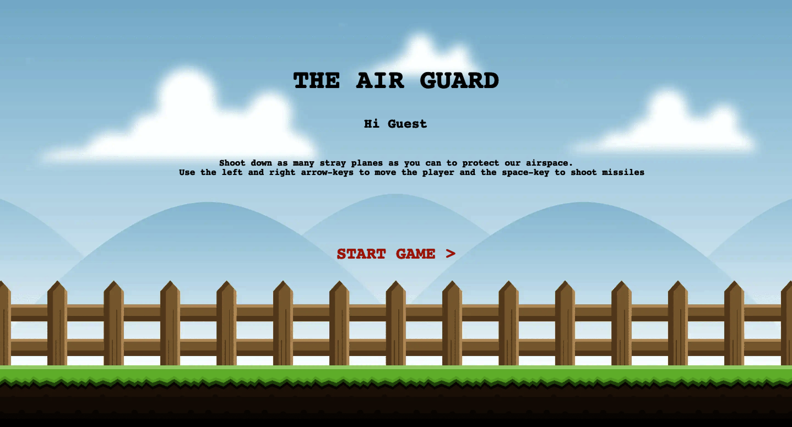
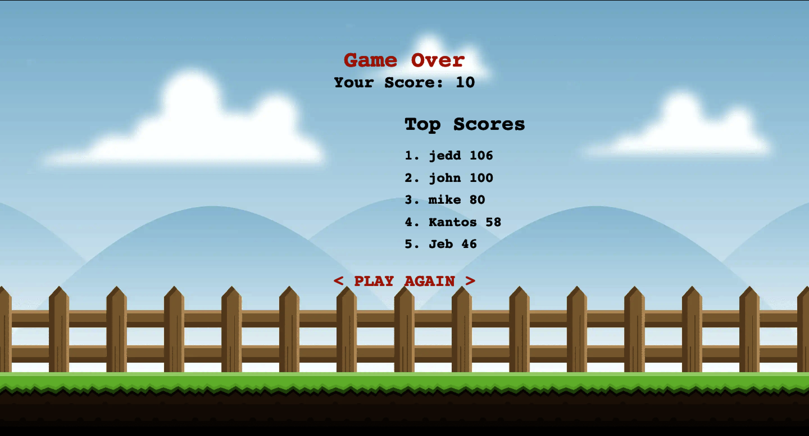

# The Air-Guard Game

> A multi-scene turn-based Role-Playing-Game that runs in a browser

This is a game that engages the player as a guard who shoots down planes in their airspace with missiles while dodging
dropped bombs.

## Built With

- HTML5,
- CSS3,
- Javascript
- Webpack
- Jest
- Phaser

## Live Demo

[Live Demo Link](https://pbkabali.github.io/The-Air-Guard-Game/)

## Getting Started

To get a local copy up and running in development mode, follow these simple steps.

### Prerequisites

- Node.js
- Browser
- Terminal

### Setup

Clone the project from [here](https://github.com/pbkabali/The-Air-Guard-Game/tree/air-guard-game)

### Install

Run `npm install` to get all the dependencies.

Run `npm run build` for one time build of bundle after changes.

Run `npm run watch` to run Webpack build in watch mode.

Run `npm start` to start the web-server.

### Usage

Go to `https://localhost:8080` in your browser.

### Run tests

Run `npm test` from the project root directory.

## Game Playing Instructions

- The first screen of the game shows the title and a request for the player to enter their name. If a name other than `Guest` is provided, the player score will be included in the leaderboard rankings when the game is over. If a name is not provided, the player will be named `Guest` by default. Click `Enter` to move to the menu screen.

- The menu screen shows some simple instructions on how to play the game. Click the `Start Game` button to enter the main game-play scene.

Once inside the main screen, follow the instructions below to play the game:

- Use the left and right arrow keys to move the player horizontally.
- Use the space-key to shoot missiles towards the enemy planes.
- Watch out for random bombs that come from the enemy planes.
- Accumulate points to get the maximum possible score by shooting as many planes as possible.
- Note that the player's shooting rounds can run out and some time is needed to reload.
- The game ends when the player is hit by a bomb and it takes you to the game over screen shown below. Here, your score is shown plus the top-five scores to-date. If you provided a name, your score will also be saved on the leaderboard.

## Authors

👤 **Paul Balitema Kabali**

- Github: [@pbkabali](https://github.com/pbkabali)
- Twitter: [@pbkabali](https://twitter.com/pbkabali)
- Linkedin: [engineerbpk](https://linkedin.com/in/engineerbpk)

## 🤝 Contributing

Contributions, issues and feature requests are welcome!

Feel free to check the [issues page](https://github.com/pbkabali/The-Air-Guard-Game/issues).

## Show your support

Give a ⭐️ if you like this project!

## Acknowledgments

- Microverse Team 140 (The Cupids)
- [OpenGameArt](https://opengameart.org/)

## 📝 License

This project is [MIT](https://opensource.org/licenses/MIT) licensed.
